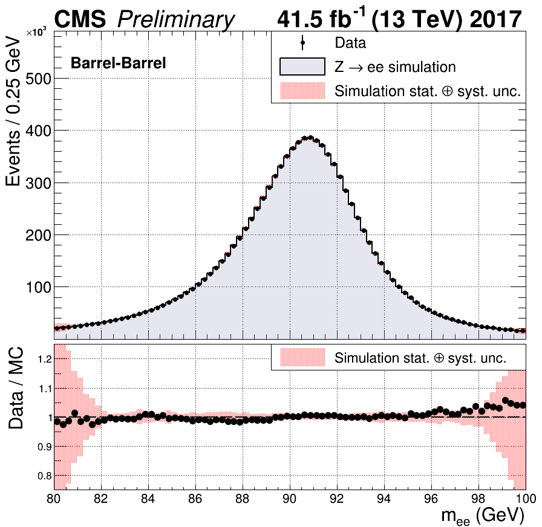

# CMS - ECAL - Scales and Smearings

A new python framework for deriving the residual scales and additional smearings for the electron energy scale.

## Motivation

This project exists as a response to the state of the process of deriving the scales and smearings for the electron energy scale using ECALELF. 
The goal of this software is to improve usability, speed, and performance of the scales and smearings derivation. 
Additionally, this software serves as a portion of the thesis of Neil Schroeder from the University of Minnesota, Twin Cities School of Physics and Astronomy.

## Example Results

Here is an example of the kind of agreement that can be obtained between data and MC.
These results show UL17 data and MC with RunFineEtaR9Et scales and EtaR9Et smearings.




## To Do

Initiating overhaul using some better coding practices and improved data handling 

## Features

This software has a number of interesting features:
* A pruner to convert root files into tsv files with only relevant branches
* A run divider to derive run bins 
* A time stabilizer which uses medians to stabilize the scale as a function of run number
* A minimzer to evaluate the scales and smearings:
	* Auto-binning of dielectron category invariant mass distributions using the Freedman-Diaconis Rule
    * Numba histograms to dramatically increase the speed of binning invariant mass distributions and NLL evaluation
    * 1D scanning or random start styles of the scales/smearings for the minimizer
    * SciPi minimizer using the 'L-BFGS-B' method for speed and memory preservation
    * Smart handling of low stats categories in the NLL evaluation

## Getting Started

Some basic instructions on how to get started:

### Prerequisites

The framework was built for use with python 3.6.4 on CMSSW_10_2_14.

### Installing

```
cmsrel CMSSW_10_2_14
git clone https://gitlab.cern.ch/nschroed/cms-ecal-scales-and-smearings.git
```
Now you'll want to checkout your own branch (name it something useful) and push it to the git repo
```
git branch myBranch
git push --set-upstream origin myBranch
git checkout myBranch
```

## Running the Framework

This framework has many options. To demonstrate it's uses, consider the following example:

### Basic 2018 Workflow

To start, you will need a file containing a list of data and mc files in the format 
```
type	treeName	filePath
```
where *type* is either "data" or "sim", *treeName* is the name of the tree in the root file containing the events you wish to analyze, and *filePath* is the full file path to the root file. An example of this can be seen in config/UltraLegacy2018.dat

You can now run the pruner:
```
./pymin.py -i INPUT_FILE --prune --pruned_file_dest='DEST_PATH' --pruned_file_name='DEST_TAG'
```
This takes your input files and will write them to tsvs in the folder DEST_PATH using the tage DEST_TAG

Now you will need to put the output files in a file, preferably in the config folder to run the run divider
```
./pymin.py -i config/ul2018.dat --run_divide
```
If you want fewer run bins you can increase the default number of events per run using the `--minEvents` argument

With your run bins in hand you can now run the time_stability step:
```
./pymin.py -i config/ul2018.dat -c datFiles/run_divide_ul2018.dat --time_stability
```
From here you can run the scales and smearings chain. Step2 is coarseEtaR9, step3 is fineEtaR9, step4 is either fineEtaR9Gain, or fineEtaR9Et:

```
./pymin.py -i config/ul2018.dat -c config/cats_step2.py -s datFiles/step1_MY_TAG_scales.dat
./pymin.py -i config/ul2018.dat -c config/cats_step2.py -s datFiles/step2_MY_TAG_scales.dat --closure
./pymin.py -i config/ul2018.dat -c config/cats_step3.py -s datFiles/step2_MY_TAG_scales.dat 
./pymin.py -i config/ul2018.dat -c config/cats_step3.py -s datFiles/step3_MY_TAG_scales.dat --closure
./pymin.py -i config/ul2018.dat -c config/cats_step4_gain.py -s datFiles/step3_MY_TAG_scales.dat
./pymin.py -i config/ul2018.dat -c config/cats_step4_gain.py -s datFiles/step4_MY_TAG_scales.dat --closure
./pymin.py -i config/ul2018.dat -c config/cats_step4_et.py -s datFiles/step3_MY_TAG_scales.dat
./pymin.py -i config/ul2018.dat -c config/cats_step4_et.py -s datFiles/step4_MY_TAG_scales.dat --closure
```

## Credit

Thanks to Shervin Nourbahksh, Peter Hansen, and Rajdeep Chatterjee for development on the previous scales and smearings code in ECALELF.
Thanks to Rajdeep Chatterjee for input on and review of this code.

## Contact

should something arise in which I must be contacted you can reach me at   
schr1077@umn.edu
